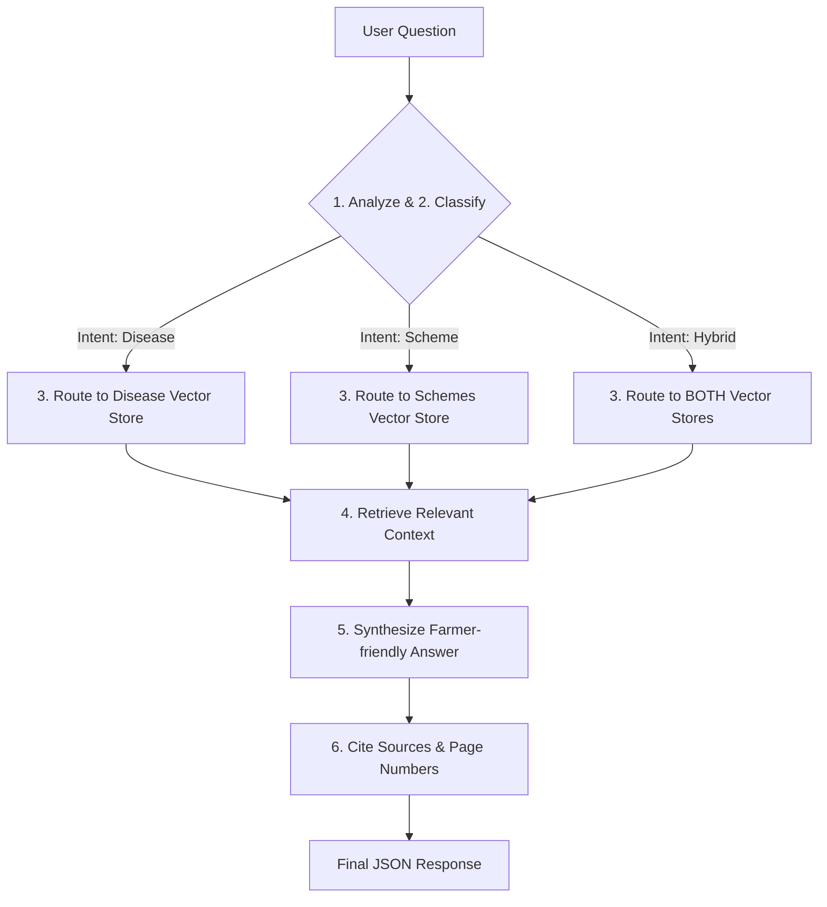
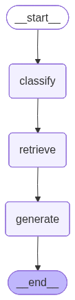
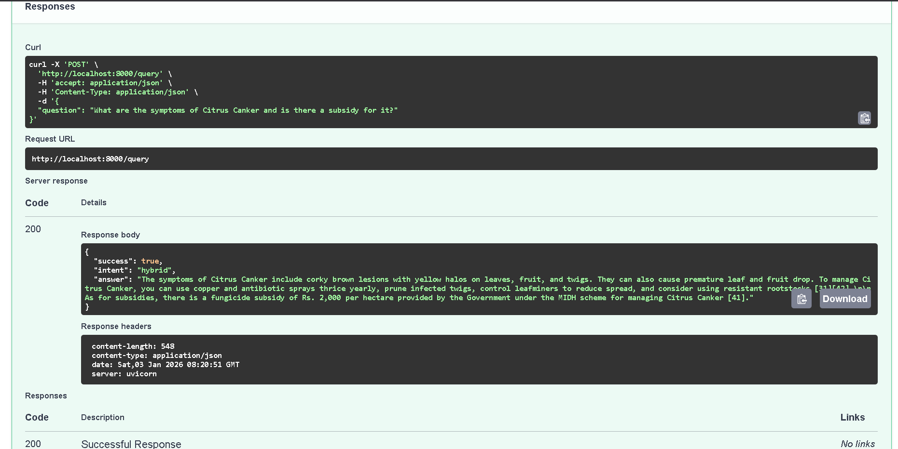
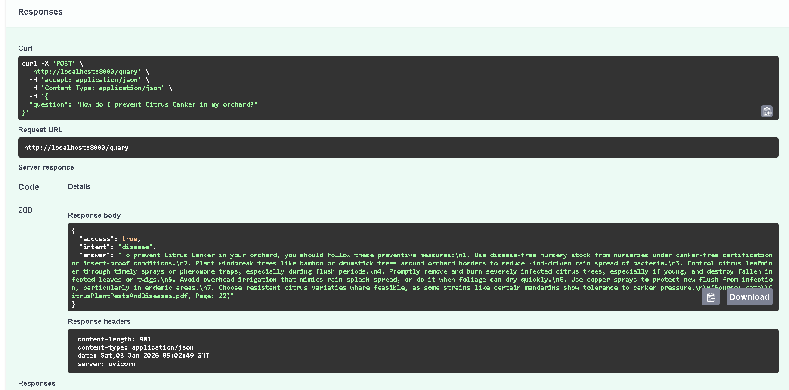

# AgriGPT: Agentic RAG Chatbot for Citrus Farmers

AgriGPT is an intelligent backend application built with **FastAPI**, **LangChain**, and **LangGraph**. It helps farmers diagnose citrus diseases and navigate complex government agricultural schemes using a conversational interface.

## Features

- **Intent Detection:** Automatically classifies queries into `Disease`, `Scheme`, or `Hybrid`.
- **Agentic Routing:** Dynamically routes queries to the specific knowledge base using LangGraph.
- **RAG with Citations:** Retrieves context from technical PDFs and provides source citations (Filename & Page Number).
- **Farmer-Friendly UI:** Designed to provide actionable advice in simple language.

## Tech Stack

- **Framework:** FastAPI
- **Orchestration:** LangGraph / LangChain
- **LLM:** gpt-3.5-turbo
- **Embeddings:** HuggingFace (Sentence-Transformers)
- **Vector Database:** ChromaDB

## Installation & Setup

1. **Clone the repository:**
   ```bash
   git clone https://github.com/sachin62025/agrigpt-backend.git
   cd agrigpt-backend
   ```
2. **Set up Virtual Environment:**
   ```bash
   python -m venv venv
   venv\Scripts\activate
   pip install -r requirements.txt
   ```
3. **Environment Variables:**
   Create a .env file:
   ```bash
   OPENAI_API_KEY=openai_api_key
   ```
4. **Data Ingestion:**
   Place your PDFs in the data/ folder and run:
   ```bash
   python -m src.ingestion
   ```
5. **Run the Application:**
   ```bash
   python main.py
   ```

The API will be available at http://localhost:8000. Access Swagger docs at /docs.

---

## Workflow Logic

The agent follows a 3-step graph:

- **Classify:** Analyzes query semantics to identify user intent.
- **Retrieve:** Queries the relevant ChromaDB collection (Diseases, Schemes, or both).
- **Generate:** Synthesizes a response using gpt-3.5-turbo while enforcing citation rules.





## API Examples

Endpoint: POST /query
**Request:**

```json
{
  "question": "What are the symptoms of Citrus Canker and is there a subsidy for it?"
}
```

**Response:**

```json
{
  "success": true,
  "intent": "hybrid",
  "answer": "The symptoms of Citrus Canker include corky brown lesions with yellow halos on leaves, fruit, and twigs. They can also cause premature leaf and fruit drop. To manage Citrus Canker, you can use copper and antibiotic sprays thrice yearly, prune infected twigs, control leafminers to reduce spread, and consider using resistant rootstocks [31][42].\n\nAs for subsidies, there is a fungicide subsidy of Rs. 2,000 per hectare provided by the Government under the MIDH scheme for managing Citrus Canker [41]."
}
```

---



### Example 2


